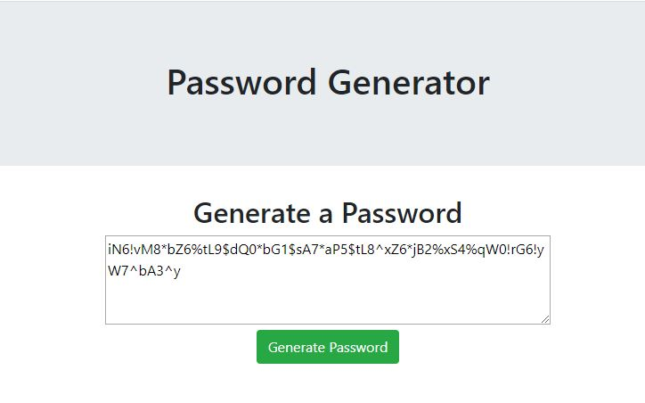

Unit 03 JavaScript Homework: Password Generator

Description

This application is used to generate a random password, dependent on the criteria(s) selected by the end user. The end user is prompted to enter the length of their password, ranging from 8-128. They also are prompted to confirm which criteria's they woud like. Once all that information is entered, the end user can hit generate and a random password string that matches the criteria the end user entered will pop up. 

The link to the website is: https://arielhuynh.github.io/homework3/.